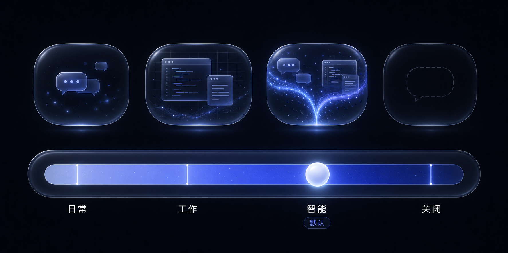
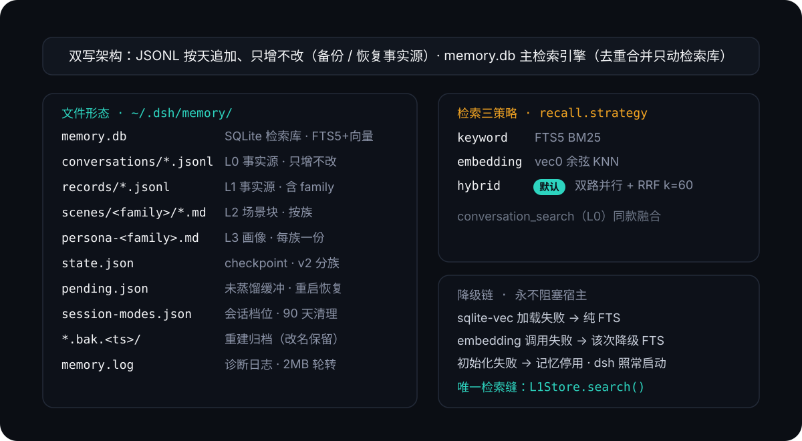

[简体中文](README.md) | **English**

<p align="center">
  
</p>

# dsh-layered-memory

A **layered distillation memory plugin** for DeepSeek Harness (persistent composition
plugin): conversations are processed in the background through L0 capture → L1 atomic
memories → L2 scene consolidation → L3 persona distillation, and relevant memories are
automatically injected into context before every model step — neither the user nor the
model needs to do anything.

> The core memory capabilities of this plugin (the L0–L3 layered distillation pipeline,
> prompts, and dual-write storage design) are modeled after **MemoryCore** from
> [TencentDB-Agent-Memory](https://github.com/TencentCloud/TencentDB-Agent-Memory):
> prompts are kept as-is; only the L2/L3 "LLM manipulates files" flow is adapted to
> "LLM outputs, engineering side executes".

## Runtime Data Flow

<p align="center">
  
</p>

The plugin attaches to DSH-native event seams (`session/event` for capture,
`agent/pre-step` for injection), reuses the host's `ctx.llm` for distillation, and stays
fully transparent to both user and model. It also registers three model-callable memory
tools: `memory_search` / `conversation_search` / `memory_read_scene`.

## Layered Memory (L0–L3)

<p align="center">
  
</p>

- **Pending buffer persistence**: messages awaiting retry after a failed extraction, and
  messages accumulating toward the next trigger threshold, are held in mode-bucketed
  buffers (`pending.json`, atomically persisted after every distillation attempt) —
  nothing is lost on restart; a catch-up run happens 20s after startup, and on failure
  the buffer simply waits for the next same-mode conversation;
- **Rebuild** (Settings → Memory → Overview → Rebuild): re-derives all derived layers
  from the L0 raw conversations as the source of truth. Old `records/`, `scenes/`,
  `persona-*.md` are archived as a whole (renamed `*.bak.<timestamp>`, never deleted),
  the retrieval DB is cleared, checkpoints reset, then L1→L2→L3 are re-distilled
  session-by-session in unified `auto` mode. Rebuild chunks run on a low-priority
  queue — distillation for live conversations always goes first; the UI includes a
  confirmation dialog (session/message/estimated-call counts), a progress bar, and
  cancellation (completed parts are kept).

## Per-Session Memory Modes

<p align="center">
  
</p>

- **Control**: the pill next to the mode selector in the input bar (`Memory · Auto`);
  clicking opens a macOS-style sliding picker above — release to snap to the nearest
  mode; adapts to light/dark themes;
- Each session's choice is persisted by sessionId to `session-modes.json`, surviving
  restarts/session restore; stacks with the global switches (global is the master gate);
  L2/L3 are fully family-isolated — content never leaks across families.

## Getting Started

Requires Node ≥ 22.16. Two invocation styles — the `npx` prefix can replace `dsh` in
any command below:

```bash
# Option 1: run the official CLI directly via npx (no pre-installed dsh; version can be pinned, e.g. dsh-layered-memory@0.6.1)
npx -y @deepseek-ai/dsh plugin --profile web add dsh-layered-memory

# Option 2: with the dsh CLI installed (dsh is a pnpm forwarder; npm i -g pnpm first if missing)
dsh plugin --profile web add dsh-layered-memory

# Alternative sources: GitHub repo / local path (dev & debugging, link: points at the repo; npm run build + restart dsh to apply)
dsh plugin --profile web add https://github.com/JunNanLYS/dsh-layered-memory
dsh plugin --profile web add /path/to/dsh-layered-memory
```

This package declares a `dsh.bundle` composition layer (`cordis.patch.yml`); after
installation the **plugin entry is mounted automatically** — no need to hand-edit
`$DSH_HOME/profiles/web/cordis.patch.yml`. Then restart DeepSeek Harness and verify:
the appearance of `conversations/ records/ scenes/` and `memory.db` under
`~/.dsh/memory/` means the plugin applied successfully; the "Memory" page in settings
and the mode pill in the input bar mean the client half is ready.

> ⚠️ **Security note**: installing a plugin = running third-party code with your
> privileges. This plugin reads session content, writes files in its data directory,
> and calls the LLM/embedding services you configured; if that concerns you, review
> the source first (`src/`).

**Uninstall**: `dsh plugin --profile web remove dsh-layered-memory` + restart. Data
stays in `~/.dsh/memory/`; delete the whole directory manually if you don't need it.

### Development from Source

```bash
git clone https://github.com/JunNanLYS/dsh-layered-memory
cd dsh-layered-memory
npm install && npm run build
dsh plugin --profile web add .        # link: install; after code changes, npm run build + restart dsh
npm run smoke                         # smoke test (rebuild first: see command below)
npx tsc src/smoke.ts --outDir dist-smoke --module nodenext --moduleResolution nodenext --target es2022 --strict --skipLibCheck --esModuleInterop
```

## Configuration

Override configs go into the profile's own `cordis.patch.yml` as a **top-level bare
patch entry** (direct `id:`, not wrapped in `insert:` — an insert with the same id as
the bundle layer appends and causes `duplicate loader entry id` startup failure):

```yaml
- id: dsh-memory
  name: dsh-layered-memory
  config:                    # keys replace whole lines (no deep merge); write out all keys you want to keep
    family: auto             # default mode for new sessions: auto | chat | work
    llm:                     # distillation model route (falls back to the current default model if empty)
      provider: ''
      model: ''
```

| Field | Default | Description |
| --- | --- | --- |
| `family` | `auto` | Default memory mode for new sessions: `auto` (both families) \| `chat` (personal) \| `work` (work); switchable per session via the input-bar control |
| `dataDir` | `$DSH_HOME/memory` | Data directory |
| `capture.enabled` | `true` | L0 capture |
| `capture.stripCodeBlocks` | `true` | Strip code blocks from assistant messages |
| `capture.maxMessageChars` | `4000` | Max characters per message |
| `extract.enabled` | `true` | L1 extraction |
| `extract.minMessages` | `1` | Run L1 extraction after N new messages accumulate |
| `extract.backgroundMessages` | `10` | Background messages attached to extraction |
| `extract.candidatePool` | `5` | Dedup candidate pool size |
| `l2.enabled` | `true` | L2 scene consolidation |
| `l2.minNewMemories` | `5` | New-memory threshold since last L2 consolidation |
| `l2.maxScenes` | `12` | Scene block count cap |
| `l2.sceneContextLimit` | `3` | Max similar-scene full texts attached to the L2 prompt |
| `l3.enabled` | `true` | L3 persona distillation |
| `l3.interval` | `20` | L3 distillation interval (new-memory count) |
| `recall.enabled` | `true` | Auto recall |
| `recall.maxResults` | `5` | L1 records injected per step |
| `recall.strategy` | `hybrid` | Retrieval strategy: `keyword` / `embedding` / `hybrid` |
| `recall.scoreThreshold` | `0.3` | Recall score threshold (below is not injected; applies to keyword/embedding only, not pre-fusion hybrid; tool path unfiltered) |
| `embedding.enabled` | `false` | Vector retrieval switch; off = pure FTS |
| `embedding.baseUrl` | empty | OpenAI-compatible /embeddings endpoint (e.g. `https://api.siliconflow.cn/v1`) |
| `embedding.apiKey` | empty | API key |
| `embedding.model` | empty | embedding model name |
| `embedding.dimensions` | `0` | Vector dimensions (required when enabled; must match model output) |
| `embedding.allowLocalModels` | `true` | Allow the local embedding tier (deployment ceiling; when off, no model downloads and no local tier in settings) |
| `embedding.mirror` | `https://hf-mirror.com` | Download mirror root for local models (can be changed back to `https://huggingface.co`) |
| `llm.provider/model` | empty | Distillation model override (defaults to current selection) |
| `llm.maxTokens` | `256000` | Output token cap per distillation call (unified across stages; a reasoning model's reasoning shares this budget — too low gets fully consumed by thinking, leaving 0 chars of text) |
| `llm.reasoningEffort` | `off` | Distillation reasoning-effort tier (deployment default): `off` / `high` / `max`; empty string = don't send (follow model default). Distillation is structured extraction, so thinking is off by default — a reasoning model (e.g. v4-flash) at its default `high` tier can consume the entire output budget on thinking, leaving 0 chars of text; set to empty string for models that don't recognize the effort parameter. Switchable at runtime in Settings → Memory → Overview ("follow config" falls back to this value) |
| `llm.temperature` | `0.3` | Distillation temperature |
| `llm.maxInputChars` | `700000` | Input character budget per distillation call (over-budget L1 inputs are chunked automatically) |
| `tools` | `true` | Whether to register model-callable memory tools |

## Storage Layout

<p align="center">
  
</p>

Vectors are off by default (pure FTS). DSH's `ctx.llm` has no embeddings endpoint;
semantic retrieval is provided by a **three-state embedding source** (off / remote /
local), switchable at runtime in the settings page — see the next section.

## Semantic Retrieval (Embedding Source)

Pick the embedding source in Settings → Memory → Overview → Semantic Retrieval;
it takes effect immediately, no config edit or restart:

| Source | Description |
| --- | --- |
| **Off** (default) | No vector embedding at all; pure BM25 keyword retrieval |
| **Remote** | Bring any OpenAI-compatible `/embeddings` service (selectable only when the `embedding.*` quartet is configured) |
| **Local** | Pick from a built-in model catalog, ONNX-quantized **CPU inference** — no API key, data never leaves the machine |

The local catalog is a built-in allowlist (each model pinned to a revision with
per-file sha256; arbitrary repos cannot be downloaded):

| Model | Dims | Context | Size | Notes |
| --- | --- | --- | --- | --- |
| BGE small Chinese | 512 | 512 | ~25MB | Fastest on CPU; good first taste of semantic retrieval |
| EmbeddingGemma 300M | 768 | 2048 | ~330MB | 100+ languages incl. Chinese; balanced quality/cost (same as upstream MemoryCore) |
| BGE-M3 | 1024 | 8192 | ~590MB | Best Chinese quality; a single embedding can take seconds |

- **Download**: one click on the model card (default mirror `hf-mirror.com`, resumable
  downloads + sha256 integrity checks); stored under `models/<id>/` in the data
  directory, deletable from the settings page at any time;
- **On-demand runtime**: the inference runtime (transformers.js, ~100–200MB) is
  installed only on first switch to the local tier, into `runtime/` in the data
  directory — never in the plugin's dependency tree or install directory;
- **Live switching**: one click to swap sources — everything is re-embedded in the
  background (visible progress, cancellable; retrieval silently degrades to keywords
  in the meantime, conversations unaffected; a dimension change rebuilds the vector
  table at the new size); a failed switch keeps the old source, which a restart
  still uses;
- **Effective = deployment ceiling AND runtime choice**: `embedding.allowLocalModels=false`
  disables the local tier entirely; without the `embedding.*` quartet the remote tier
  is unavailable (enterprise deployments can lock this down). The choice persists in
  `embedding-source.json`.

## Logging & Troubleshooting

The dsh host prints plugin logs to the console; the plugin mirrors info and above to
`memory.log` in its data directory. The typical log path of one conversation turn:
`L0 capture` → `L0 flush` → `distillation pipeline start` → `LLM call (input/output
chars, duration)` → `L1 extraction done` → `pipeline end`; the next turn shows
`recall hit N L1 records`. Empty LLM output carries full diagnostics (finish reason /
token counts / reasoning excerpt); JSON parse failures include the first 400 characters
of the raw model output; all failure warns carry the first stack frame.

## Differences from MemoryCore

- The full pipeline is embedded (no external Gateway); distillation reuses DSH's own LLM;
- L2/L3 changed from "LLM manipulates file tools" to "LLM outputs operation JSON / full documents, engineering side executes";
- Recall injection happens at `agent/pre-step` + agent-scoped `systemPrompt.context` (DSH-native events/services);
- Storage/retrieval is a single-machine slimmed version of the official sqlite backend (drops multi-tenant isolation columns, TCVDB cloud backend, audit tables; tokenization uses a bundled CJK bigram instead of jieba, keeping zero native dependencies — sqlite-vec is the only native extension, auto-degrading on load failure).

## Credits

The core memory capabilities (layered distillation pipeline, prompt design, and the
dual-write storage architecture) are modeled after **MemoryCore** from
[TencentCloud/TencentDB-Agent-Memory](https://github.com/TencentCloud/TencentDB-Agent-Memory).
Thanks to the original project for open-sourcing its design and implementation.

## License

[MIT](LICENSE)
