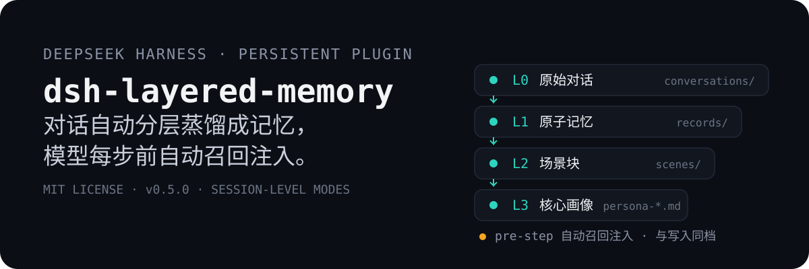

[简体中文](README.md) | **English**

<p align="center">
  
</p>

# dsh-layered-memory

A **layered distillation memory plugin** for DeepSeek Harness (persistent composition
plugin): conversations are processed in the background through L0 capture → L1 atomic
memories → L2 scene consolidation → L3 persona distillation, and relevant memories are
automatically injected into context before every model step — neither the user nor the
model needs to do anything. Ported from the pipeline design of
[MemoryCore](https://github.com/TencentDB-Agent-Memory) (TencentDB Agent Memory):
prompts are kept as-is; only the L2/L3 "LLM manipulates files" flow is adapted to
"LLM outputs, engineering side executes".

## Core Capabilities

### Layered Memory (L0–L3)

| Layer | Content | Storage |
| --- | --- | --- |
| L0 | Per-turn user/assistant messages (cleaned, code blocks and injected tags stripped) | `conversations/YYYY-MM-DD.jsonl` + SQLite |
| L1 | Scene segmentation + memory extraction (chat: persona/episodic/instruction; work: work_fact/work_task/work_method/work_artifact) + conflict-detection dedup & merge, each record family-tagged | `records/YYYY-MM-DD.jsonl` + SQLite (FTS5 + optional vectors, family column) |
| L2 | New memories consolidated into Markdown scene documents (META blocks, heat management, merge caps), consolidated per family | `scenes/chat/*.md`, `scenes/work/*.md` |
| L3 | Persona distilled from changed scenes (chat: user persona ≤2000 chars; work: Team Operating Doctrine ≤1200 chars), one per family | `persona-chat.md`, `persona-work.md` |

Pipeline principles: all distillation calls reuse DSH's own `ctx.llm`; any stage
failure is logged only and never blocks the agent loop; recall injection is wrapped
in tags that are automatically stripped on the capture side, preventing feedback loops.

### Per-Session Memory Modes

Each session can independently choose a memory mode — **write and recall share the
same mode**:

| Mode | Distillation (write) | Recall (injection) |
| --- | --- | --- |
| `Auto` (default) | Single extraction with a merged-vocabulary prompt, all personal 3 + work 4 types enabled, family tag assigned by type prefix | Both families recalled; persona/scene navigation grouped by category and injected with structured `<domain>` blocks |
| `chat` | Narrow prompt with personal 3 types only, chat family only | chat memories only + chat persona/scene navigation |
| `work` | Narrow prompt with work 4 types only, work family only | work memories only + work persona/scene navigation |
| `Off` | No L0 writes, no distillation | No recall; the three memory tools return a "cloaked" notice |

- **Control**: the pill next to the mode selector in the input bar (`Memory · Auto`);
  clicking opens a macOS-style sliding picker above — release to snap to the nearest
  mode;
- **Default mode** = config `family` (`auto|chat|work`, default `auto`); each session's
  choice is persisted by sessionId to `session-modes.json`, surviving restarts/session
  restore; switching mid-session takes effect next turn, already-extracted memories
  stay in their original family;
- Stacks with the global switches (global is the master gate); L2/L3 are fully
  family-isolated — content never leaks across families.

### Memory Browser (Settings → Memory)

Multi-tab page with a mixed view of both families: **Overview** (per-layer counts +
memory mode switch panel, auto-refresh every 5s), **Memories** (L1 card list with
keyword/type/scene filters), **Scenes** (L2 full text), **Persona** (L3 full text),
**Log** (last 200 lines of `memory.log`). Switches go through the official settings
service (namespace `dsh-memory`, effective immediately, persisted across restarts);
effective rule = **static config (deployment ceiling) AND runtime switch**; data
channel is loopback RPC (`dsh-memory/*`).

## Getting Started

Requires Node ≥ 22.16. Two invocation styles — the `npx` prefix can replace `dsh` in
any command below:

```bash
# Option 1: run the official CLI directly via npx (no pre-installed dsh; version can be pinned, e.g. dsh-layered-memory@0.5.4)
npx -y @deepseek-ai/dsh plugin --profile web add dsh-layered-memory

# Option 2: with the dsh CLI installed (dsh is a pnpm forwarder; npm i -g pnpm first if missing)
dsh plugin --profile web add dsh-layered-memory

# Alternative sources: GitHub repo / local path (dev & debugging, link: points at the repo; npm run build + restart dsh to apply)
dsh plugin --profile web add https://github.com/JunNanLYS/dsh-layered-memory
dsh plugin --profile web add /path/to/dsh-layered-memory
```

This package declares a `dsh.bundle` composition layer (`cordis.patch.yml`); after
installation the **plugin entry is mounted automatically** — no need to hand-edit
`$DSH_HOME/profiles/web/cordis.patch.yml`. Then restart DeepSeek Harness and verify:
the appearance of `conversations/ records/ scenes/` and `memory.db` under
`~/.dsh/memory/` means the plugin applied successfully; the "Memory" page in settings
and the mode pill in the input bar mean the client half is ready.

> ⚠️ **Security note**: installing a plugin = running third-party code with your
> privileges. This plugin reads session content, writes files in its data directory,
> and calls the LLM/embedding services you configured; if that concerns you, review
> the source first (`src/`).

**Uninstall**: `dsh plugin --profile web remove dsh-layered-memory` + restart. Data
stays in `~/.dsh/memory/`; delete the whole directory manually if you don't need it.

### Development from Source

```bash
git clone https://github.com/JunNanLYS/dsh-layered-memory
cd dsh-layered-memory
npm install && npm run build
dsh plugin --profile web add .        # link: install; after code changes, npm run build + restart dsh
npm run smoke                         # smoke test (rebuild first: see command below)
npx tsc src/smoke.ts --outDir dist-smoke --module nodenext --moduleResolution nodenext --target es2022 --strict --skipLibCheck --esModuleInterop
```

## Configuration

Override configs go into the profile's own `cordis.patch.yml` as a **top-level bare
patch entry** (direct `id:`, not wrapped in `insert:` — an insert with the same id as
the bundle layer appends and causes `duplicate loader entry id` startup failure):

```yaml
- id: dsh-memory
  name: dsh-layered-memory
  config:                    # keys replace whole lines (no deep merge); write out all keys you want to keep
    family: auto             # default mode for new sessions: auto | chat | work
    llm:                     # distillation model route (falls back to the current default model if empty)
      provider: ''
      model: ''
```

| Field | Default | Description |
| --- | --- | --- |
| `family` | `auto` | Default memory mode for new sessions: `auto` (both families) \| `chat` (personal) \| `work` (work); switchable per session via the input-bar control |
| `dataDir` | `$DSH_HOME/memory` | Data directory |
| `capture.enabled` | `true` | L0 capture |
| `capture.stripCodeBlocks` | `true` | Strip code blocks from assistant messages |
| `capture.maxMessageChars` | `4000` | Max characters per message |
| `extract.enabled` | `true` | L1 extraction |
| `extract.minMessages` | `1` | Run L1 extraction after N new messages accumulate |
| `extract.backgroundMessages` | `10` | Background messages attached to extraction |
| `extract.candidatePool` | `5` | Dedup candidate pool size |
| `l2.enabled` | `true` | L2 scene consolidation |
| `l2.minNewMemories` | `5` | New-memory threshold since last L2 consolidation |
| `l2.maxScenes` | `12` | Scene block count cap |
| `l2.sceneContextLimit` | `3` | Max similar-scene full texts attached to the L2 prompt |
| `l3.enabled` | `true` | L3 persona distillation |
| `l3.interval` | `20` | L3 distillation interval (new-memory count) |
| `recall.enabled` | `true` | Auto recall |
| `recall.maxResults` | `5` | L1 records injected per step |
| `recall.strategy` | `hybrid` | Retrieval strategy: `keyword` / `embedding` / `hybrid` |
| `recall.scoreThreshold` | `0.3` | Recall score threshold (below is not injected; applies to keyword/embedding only, not pre-fusion hybrid; tool path unfiltered) |
| `embedding.enabled` | `false` | Vector retrieval switch; off = pure FTS |
| `embedding.baseUrl` | empty | OpenAI-compatible /embeddings endpoint (e.g. `https://api.siliconflow.cn/v1`) |
| `embedding.apiKey` | empty | API key |
| `embedding.model` | empty | embedding model name |
| `embedding.dimensions` | `0` | Vector dimensions (required when enabled; must match model output) |
| `llm.provider/model` | empty | Distillation model override (defaults to current selection) |
| `llm.maxTokens` | `20000` | Output token cap per distillation call (unified across stages; a reasoning model's reasoning shares this budget — too low gets fully consumed by thinking, leaving 0 chars of text) |
| `llm.temperature` | `0.3` | Distillation temperature |
| `llm.maxInputChars` | `700000` | Input character budget per distillation call (over-budget L1 inputs are chunked automatically) |
| `tools` | `true` | Whether to register model-callable memory tools |

## Storage Layout

Aligned with MemoryCore's official dual-write architecture: append-only JSONL files
(`conversations/`, `records/` sharded by day) are the source of truth for
backup/restore and are **never rewritten**; `memory.db` (node:sqlite + WAL + FTS5
BM25 + sqlite-vec cosine vectors) is the primary retrieval engine — updates/deletes
from dedup merges touch the retrieval DB only.

- **Three retrieval strategies** (`recall.strategy`): `keyword` (FTS5 BM25) /
  `embedding` (vec0 cosine KNN) / `hybrid` (both lanes in parallel + RRF k=60
  fusion, default); `conversation_search` (L0) uses the same fusion;
- **Vectors optional**: off by default (pure FTS). DSH's `ctx.llm` has no embeddings
  endpoint; enabling requires any OpenAI-compatible `/embeddings` service (configure
  `embedding.*`); config changes automatically drop the vector table and re-embed
  everything in the background;
- **Degradation chain**: sqlite-vec load failure → pure FTS; embedding call failure
  → degrade to FTS for that call with a one-time warning; retrieval DB init failure
  → memory features disabled entirely but dsh itself starts normally;
- **Replacement seam**: `L1Store.search()` is the single retrieval entry point.

```
memory/
├── memory.db              # SQLite retrieval DB (L0/L1 metadata + FTS5 + optional vectors; L1 has a family column)
├── conversations/2026-01-01.jsonl  # L0 raw conversation source of truth (one file per day, append-only; not family-split)
├── records/2026-01-01.jsonl        # L1 atomic memory source of truth (one file per day, append-only; family field included)
├── scenes/chat/*.md       # L2 scene blocks (chat family)
├── scenes/work/*.md       # L2 scene blocks (work family)
├── persona-chat.md        # L3 persona (chat family: user persona)
├── persona-work.md        # L3 persona (work family: Team Operating Doctrine)
├── state.json             # pipeline checkpoint (v2 family-split: families.chat / families.work)
├── session-modes.json     # session mode map (sessionId → mode, auto-pruned after >90 days)
└── memory.log             # diagnostic log (info+, rotates to memory.log.1 beyond 2MB)
```

## Logging & Troubleshooting

The dsh host prints plugin logs to the console; the plugin mirrors info and above to
`memory.log` in its data directory. The typical log path of one conversation turn:
`L0 捕获 turn=N …条` → `L0 落盘 N 条` → `蒸馏管线开始（…待重试 M 条）` →
`LLM 调用 provider/model：输入 x → 输出 y 字符（z s）` → `L1 抽取完成（…新增 Y 条）` →
`蒸馏管线结束`; the next turn shows `召回命中 N 条 L1`. Empty LLM output carries full
diagnostics (finish reason / token counts / reasoning excerpt); JSON parse failures
include the first 400 characters of the raw model output; all failure warns carry the
first stack frame.

## Differences from MemoryCore

- The full pipeline is embedded (no external Gateway); distillation reuses DSH's own LLM;
- L2/L3 changed from "LLM manipulates file tools" to "LLM outputs operation JSON / full documents, engineering side executes";
- Recall injection happens at `agent/pre-step` + agent-scoped `systemPrompt.context` (DSH-native events/services);
- Storage/retrieval is a single-machine slimmed version of the official sqlite backend (drops multi-tenant isolation columns, TCVDB cloud backend, audit tables; tokenization uses a bundled CJK bigram instead of jieba, keeping zero native dependencies — sqlite-vec is the only native extension, auto-degrading on load failure).

## License

[MIT](LICENSE)
