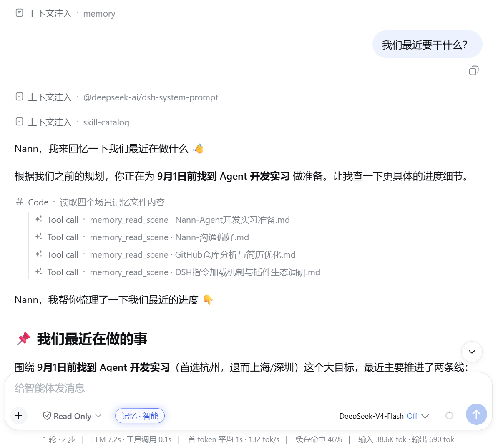
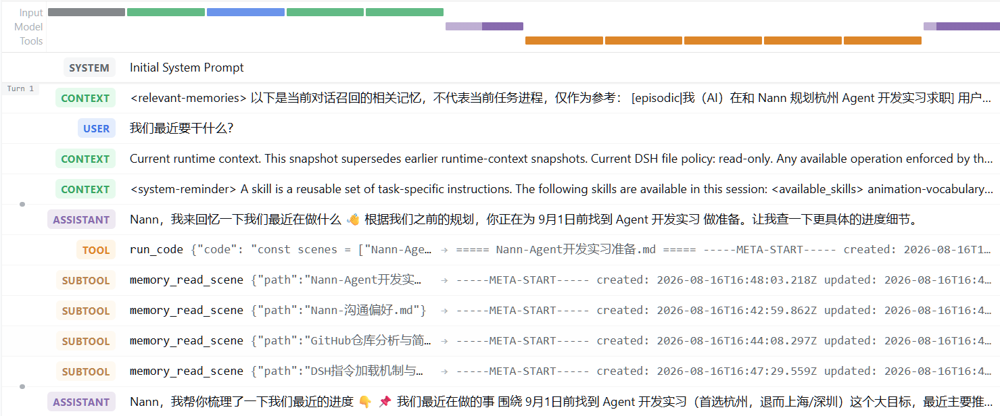
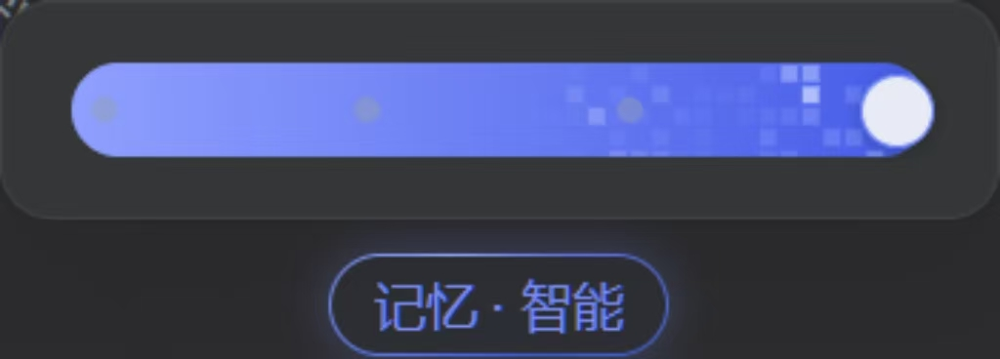
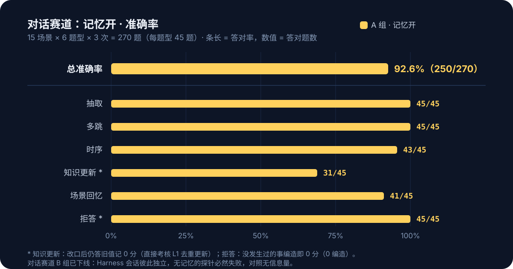
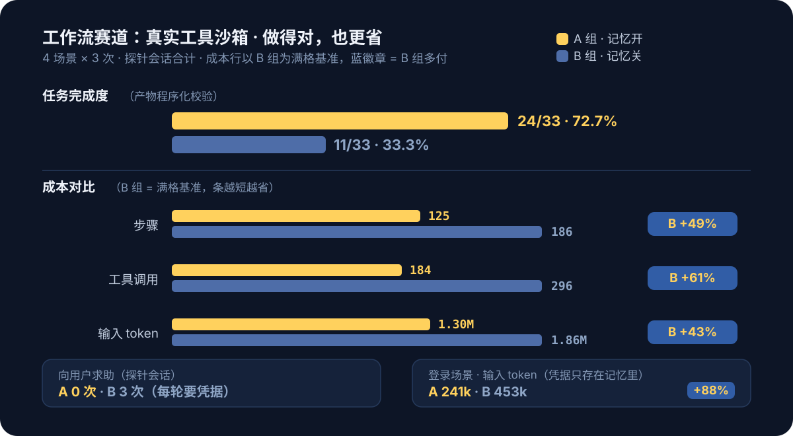

<div align="center">


# dsh-layered-memory

**A layered distillation memory plugin for DeepSeek Harness: conversations are processed in the background through L0 capture → L1 atomic memories → L2 scene consolidation → L3 persona distillation, and relevant memories are automatically injected into context before every model step — neither the user nor the model needs to do anything.**

[简体中文](README.md) · [Latest release](https://github.com/JunNanLYS/dsh-layered-memory/releases/latest) · [Report issues](https://github.com/JunNanLYS/dsh-layered-memory/issues)

[](https://www.npmjs.com/package/dsh-layered-memory)
[](https://github.com/deepseek-ai/deepseek-harness)
[](LICENSE)

</div>

## Getting Started

Requires Node ≥ 22.16. Two invocation styles — the `npx` prefix can replace `dsh` in
any command below:

```bash
# Option 1: run the official CLI directly via npx (no pre-installed dsh; version can be pinned, e.g. dsh-layered-memory@0.8.2)
npx -y @deepseek-ai/dsh plugin --profile web add dsh-layered-memory

# Option 2: with the dsh CLI installed (dsh is a pnpm forwarder; npm i -g pnpm first if missing)
dsh plugin --profile web add dsh-layered-memory

# Alternative sources: GitHub repo / local path (dev & debugging, link: points at the repo; npm run build + restart dsh to apply)
dsh plugin --profile web add https://github.com/JunNanLYS/dsh-layered-memory
dsh plugin --profile web add /path/to/dsh-layered-memory
```

### Install via an AI Agent (Recommended)

If your current agent can run terminal commands, send it this message as-is:

```text
Please install the dsh-layered-memory plugin for the web profile of DeepSeek Harness.

Run only the two commands below and do not modify any other profile:
dsh plugin --profile web add dsh-layered-memory
dsh --profile web --dump-config

Confirm that dsh-layered-memory appears in the output, then report the result to me.
Do not close or restart my running DSH yourself; after installation, remind me to manually restart the DSH Web Host.
```

The agent should report the installation result and explicitly tell you whether
`dsh-layered-memory` has appeared in the configuration.

This package declares a `dsh.bundle` composition layer (`cordis.patch.yml`); after
installation the **plugin entry is mounted automatically** — no need to hand-edit
`$DSH_HOME/profiles/web/cordis.patch.yml`. Then restart DeepSeek Harness and verify:
the appearance of `conversations/ records/ scenes/` and `memory.db` under
`~/.dsh/memory/` means the plugin applied successfully; the "Memory" page in settings
and the mode pill in the input bar mean the client half is ready.

> ⚠️ **Security note**: installing a plugin = running third-party code with your
> privileges. This plugin reads session content, writes files in its data directory,
> and calls the LLM/embedding services you configured; if that concerns you, review
> the source first (`src/`).

**Uninstall**: `dsh plugin --profile web remove dsh-layered-memory` + restart. Data
stays in `~/.dsh/memory/`; delete the whole directory manually if you don't need it.

### Development from Source

```bash
git clone https://github.com/JunNanLYS/dsh-layered-memory
cd dsh-layered-memory
npm install && npm run build
dsh plugin --profile web add .        # link: install; after code changes, npm run build + restart dsh
npm run smoke                         # smoke test (rebuild first: see command below)
npx tsc src/smoke.ts --outDir dist-smoke --module nodenext --moduleResolution nodenext --target es2022 --strict --skipLibCheck --esModuleInterop
```

## Runtime Data Flow

<p align="center">
  
</p>

The plugin attaches to DSH-native event seams (`session/event` for capture,
`agent/pre-step` for injection) and reuses the host's `ctx.llm` for distillation. Recall
is presented as **message-side injection**: relevant memories enter the conversation as a
synthetic message placed right before the user's new message, rendered as a
**"Context injection · memory"** row in the chat flow (expand to see the hits) — so you
can see "memory at work" directly. Injected content is bounded by length and
time budgets — oversized lines are truncated (pointing the model at the memory tools for
the full text) and a timed-out recall silently skips that turn, never slowing the chat. It
also registers three model-callable memory tools: `memory_search` /
`conversation_search` / `memory_read_scene`.

In action: the "Context injection · memory" row surfaces relevant memories first, and
the model then calls `memory_read_scene` directly to read scene blocks before answering
from memory:

<p align="center">
  
</p>

In restricted sessions where only the code-execution entry point is available, the model
reaches the memory tools indirectly through `run_code` (nested as SUBTOOL calls in the
trajectory view):

<p align="center">
  
</p>

## Layered Memory (L0–L3)

<p align="center">
  
</p>

## Per-Session Memory Modes

<p align="center">
  
</p>

- **Control**: the pill next to the mode selector in the input bar (`Memory · Auto`);
  clicking opens a macOS-style sliding picker above — release to snap to the nearest
  mode; adapts to light/dark themes;
- Each session's choice is persisted by sessionId to `session-modes.json`, surviving
  restarts/session restore; stacks with the global switches (global is the master gate);
  L2/L3 are fully family-isolated — content never leaks across families.

## UI Preview

<p align="center">
  
  
</p>

## Measured Comparison (DSH-MemBench: Automated Benchmark)

Screenshots show what the plugin looks like — this section answers "**what does enabling it actually buy you?**" with measured numbers from an **automated benchmark** ([`bench/`](./bench/), one command to reproduce). Method: the same scenario bank with verbatim-identical inputs runs in **Group A (memory on)** and **Group B (memory off)**, 3 repetitions each, merged; environment DeepSeek official `deepseek-v4-flash`, plugin 0.8.0, Windows; taxonomy adapted from [LongMemEval](https://github.com/xiaowu0162/longmemeval) / [LoCoMo](https://snap-research.github.io/locomo/) / [AMB](https://github.com/vectorize-io/agent-memory-benchmark).

### Dialog track (15 scenarios × 6 probe types × 3 reps = 270 questions/group): does it remember correctly

<p align="center">
  
</p>

**Dual-channel recall** (Group A): passive injection hit rate **75.1%** (the answer's key points appear in the recall injection, 169/225); most of the rest the model recovered by **actively calling the memory tools** — 84 questions with active queries, **60 rescued by tools**. The end-to-end 92.6% is the composite of both channels plus model utilization. With the memory store accumulating across scenarios for the whole run, 144 probe injections carried other scenarios' memories (honestly counted) — yet overall accuracy held at 92.6%: interference resistance under a growing store, measured.

### Workflow track (4 scenarios × 3 reps, real tool sandbox): does it do it right, and cheaper

<p align="center">
  
</p>

**Login scenario close-up** (credentials exist only in memory; the site is a local service with unforgeable tokens): Group A completed all three runs **in a single turn each** (6/6, 241k input); Group B had to **ask the user for credentials every time** (3 asks, double the turns) and still finished only 5/6, at 453k input — **+88%**. This is one of memory's core values: **what it saves is not task difficulty, but pointless round-trips and re-teaching**.

### Methodology & reproduction

```bash
node bench/harness/run.mjs --arm A --repeats 3 --provider deepseek-official --model deepseek-v4-flash
node bench/harness/run.mjs --arm B --repeats 3 --provider deepseek-official --model deepseek-v4-flash   # dialog track
node bench/harness/run.mjs --track workflow --arm A/B --repeats 3 ...                                  # workflow track
node bench/harness/report.mjs --latest [dialog|workflow]                                               # aggregate report
```

- Scoring: programmatic `contains-all` plus an LLM judge against key points (every answer and verdict is preserved in `result.json` for human audit); workflow completion is verified programmatically from produced files and their contents;
- Metrics come from provider-reported usage (input with cache-hit split) and session-event folding; the **steady-state cache rate** excludes each session's first request (A 88.7% vs B 85.4% — memory injection does not hurt caching);
- Regression use: run before/after a plugin change and diff with `compare.mjs` (environment header check + Group-B control-drift warning);
- Limitations (stated honestly): single machine, 3 merged runs; the judge model is the same as the tested model; the scenario bank is author-built (biased toward memory-advantage scenarios — reproduce it yourself); the tool audit flags out-of-sandbox access (agents occasionally probed the user home dir in tests; this benchmark's answers never exist in the real memory store, so the numbers are unaffected).

Full reports and per-question data: [`bench/baseline/`](./bench/baseline/).

## Configuration

Override configs go into the profile's own `cordis.patch.yml` as a **top-level bare
patch entry** (direct `id:`, not wrapped in `insert:` — an insert with the same id as
the bundle layer appends and causes `duplicate loader entry id` startup failure):

```yaml
- id: dsh-memory
  name: dsh-layered-memory
  config:                    # keys replace whole lines (no deep merge); write out all keys you want to keep
    family: auto             # default mode for new sessions: auto | chat | work
    llm:                     # static distillation route (both fields set = deployment pin,
      provider: ''           # which outranks the settings-page selection; when empty the route
      model: ''              # follows the settings-page "distillation model" picker or the default model)
```

| Field | Default | Description |
| --- | --- | --- |
| `family` | `auto` | Default memory mode for new sessions: `auto` (both families) \| `chat` (personal) \| `work` (work); switchable per session via the input-bar control |
| `dataDir` | `$DSH_HOME/memory` | Data directory |
| `capture.enabled` | `true` | L0 capture |
| `capture.stripCodeBlocks` | `true` | Strip code blocks from assistant messages |
| `capture.maxMessageChars` | `4000` | Max characters per message |
| `extract.enabled` | `true` | L1 extraction |
| `extract.minMessages` | `6` | Steady-state trigger threshold: run L1 extraction once a session accumulates N new messages. The effective threshold ramps up 1→2→4→…→N (first turn yields memories immediately, then batches to save calls) |
| `extract.idleSeconds` | `300` | Idle flush: distill a session's pending slice after N seconds of silence (catches "user left before reaching the threshold"); `0` disables |
| `extract.backgroundMessages` | `10` | Background messages attached to extraction (fetched per session from L0 — no cross-session contamination) |
| `extract.candidatePool` | `5` | Dedup candidate pool size |
| `l2.enabled` | `true` | L2 scene consolidation |
| `l2.minNewMemories` | `5` | New-memory threshold since last L2 consolidation |
| `l2.maxScenes` | `12` | Scene block count cap |
| `l2.sceneContextLimit` | `3` | Max similar-scene full texts attached to the L2 prompt |
| `l3.enabled` | `true` | L3 persona distillation |
| `l3.interval` | `20` | L3 distillation interval (new-memory count) |
| `recall.enabled` | `true` | Auto recall |
| `recall.maxResults` | `5` | Max L1 records injected before each new user message |
| `recall.maxCharsPerMemory` | `500` | Per-memory character cap for injected recall (overlong lines truncated with a hint to use the memory tools for the full text); `0` disables |
| `recall.maxTotalRecallChars` | `2000` | Total character cap per injected recall batch (lowest-ranked tail dropped first); `0` disables |
| `recall.timeoutMs` | `5000` | Overall recall budget (ms): a timed-out recall skips that turn without blocking the chat; `0` disables |
| `recall.includePersona` | `true` | Inject persona context into the system prompt (`<user-persona>`, stable zone) |
| `recall.includeSceneNav` | `true` | Inject scene navigation into the system prompt (`<scene-navigation>`, stable zone) |
| `recall.strategy` | `hybrid` | Retrieval strategy: `keyword` / `embedding` / `hybrid` |
| `recall.scoreThreshold` | `0.3` | Recall score threshold (below is not injected; applies to keyword/embedding only, not pre-fusion hybrid; tool path unfiltered) |
| `embedding.enabled` | `false` | Vector retrieval switch; off = pure FTS |
| `embedding.baseUrl` | empty | OpenAI-compatible /embeddings endpoint (e.g. `https://api.siliconflow.cn/v1`) |
| `embedding.apiKey` | empty | API key |
| `embedding.model` | empty | embedding model name |
| `embedding.dimensions` | `0` | Vector dimensions (required when enabled; must match model output) |
| `embedding.maxInputChars` | `5000` | Max characters per text (overlong inputs truncated) |
| `embedding.timeoutMs` | `10000` | Per-call embedding timeout (ms) |
| `embedding.allowLocalModels` | `true` | Allow the local embedding tier (deployment ceiling; when off, no model downloads and no local tier in settings) |
| `embedding.mirror` | `https://hf-mirror.com` | Download mirror root for local models (can be changed back to `https://huggingface.co`) |
| `embedding.proxy` | `''` | Three-state download proxy: `''` (default) = auto-detect proxy env vars (`HTTPS_PROXY`/`ALL_PROXY` etc., honoring `NO_PROXY`); `none` = disable, always direct; any other value = proxy URL (e.g. `http://127.0.0.1:7890`). Direct connections to the mirror are intermittently unreachable on some networks (connect timeouts and poisoned bytes have both been observed) — keep the default auto-detection on machines with a proxy |
| `llm.provider/model` | empty | Static distillation route (deployment pin): when **both** fields are set the route is locked, outranking the settings-page selection and the default model (deployments can force distillation onto a specific route); when empty the route follows "settings-page selection → default model". At runtime, switch among **configured providers** (including custom ones added in dsh Settings → Models) via the "distillation model" picker in Settings → Memory → Overview — effective immediately, no restart needed |
| `llm.maxTokens` | `65536` | Fallback output cap for non-layered calls. Each distillation stage has its own budget (extraction 16k / dedup 8k / L2 32k / L3 16k; auto ×4 when reasoning effort is high/max, so thinking can't starve the text budget); the per-layer budgets are runtime-adjustable in Settings → Memory → Overview → distillation parameters (empty/0 = built-in defaults) |
| `llm.reasoningEffort` | `off` | Distillation reasoning-effort tier (deployment default): `off` / `high` / `max`; empty string = don't send (follow model default). Distillation is structured extraction, so thinking is off by default — a reasoning model (e.g. v4-flash) at its default `high` tier can consume the entire output budget on thinking, leaving 0 chars of text; set to empty string for models that don't recognize the effort parameter. Switchable at runtime in Settings → Memory → Overview ("follow config" falls back to this value) |
| `llm.temperature` | `0.3` | Distillation temperature |
| `llm.maxInputChars` | `700000` | Input character budget per distillation call (over-budget L1 inputs are chunked automatically); runtime-adjustable in Settings → distillation parameters → input budget (empty/0 = follow this value) |
| `llm.timeoutMs` | `120000` | Per-call distillation timeout (ms) |
| `tools` | `true` | Whether to register model-callable memory tools |

## Storage Layout

<p align="center">
  
</p>

Vectors are off by default (pure FTS). DSH's `ctx.llm` has no embeddings endpoint;
semantic retrieval is provided by a **three-state embedding source** (off / remote /
local), switchable at runtime in the settings page — see the next section.

## Semantic Retrieval (Embedding Source)

Pick the embedding source in Settings → Memory → Overview → Semantic Retrieval;
it takes effect immediately, no config edit or restart:

<p align="center">
  
</p>

Three sources: **Off** (default; no vector embedding at all, pure BM25 keyword
retrieval), **Remote** (bring any OpenAI-compatible `/embeddings` service, selectable
only when the `embedding.*` quartet is configured), **Local** (pick from a built-in
model catalog, ONNX-quantized **CPU inference** — no API key, data never leaves the
machine). The local catalog is a built-in allowlist (each model pinned to a revision
with per-file sha256; arbitrary repos cannot be downloaded).

- **Download**: one click on the model card (default mirror `hf-mirror.com`, resumable
  downloads + sha256 integrity checks; a proxy is used when direct access is
  unreachable — proxy env vars like `HTTPS_PROXY`/`ALL_PROXY` are auto-detected by
  default, see `embedding.proxy`). Per-file failures auto-retry with a rotated cache
  key (`?dshmem-retry=N`, sidestepping occasionally bad CDN cache objects); hash
  mismatches restart from zero, network errors resume from the checkpoint; stored
  under `models/<id>/` in the data directory, deletable from the settings page at any time;
- **On-demand runtime**: the inference runtime (transformers.js, ~100–200MB) is
  installed only on first switch to the local tier, into `runtime/` in the data
  directory — never in the plugin's dependency tree or install directory;
- **Live switching**: one click to swap sources — everything is re-embedded in the
  background (visible progress, cancellable; retrieval silently degrades to keywords
  in the meantime, conversations unaffected; a dimension change rebuilds the vector
  table at the new size); a failed switch keeps the old source, which a restart
  still uses;
- **Effective = deployment ceiling AND runtime choice**: `embedding.allowLocalModels=false`
  disables the local tier entirely; without the `embedding.*` quartet the remote tier
  is unavailable (enterprise deployments can lock this down). The choice persists in
  `embedding-source.json`.

## Logging & Troubleshooting

The dsh host prints plugin logs to the console; the plugin mirrors info and above to
`memory.log` in its data directory. The typical log path of one conversation turn:
`L0 capture` → `L0 flush` → `distillation pipeline start` → `LLM call (input/output
chars, duration)` → `L1 extraction done` → `pipeline end`; the next turn shows
`recall hit N L1 records`. Empty LLM output carries full diagnostics (finish reason /
token counts / reasoning excerpt); JSON parse failures include the first 400 characters
of the raw model output; all failure warns carry the first stack frame. The JSONL
fact source is appended per turn and relies on OS write-back (no per-line fsync);
an extreme crash (power loss) loses at most a small tail, and the index DB can be
fully re-derived from the fact source via "Rebuild memories".

## Differences from MemoryCore

- The full pipeline is embedded (no external Gateway); distillation reuses DSH's own LLM;
- L2/L3 changed from "LLM manipulates file tools" to "LLM outputs operation JSON / full documents, engineering side executes";
- Recall injection happens at `agent/pre-step` (message-side synthetic message, the official pre-step replacement semantics) plus agent-scoped `systemPrompt.context` (persona/navigation stable zone — DSH-native events/services);
- Storage/retrieval is a single-machine slimmed version of the official sqlite backend (drops multi-tenant isolation columns, TCVDB cloud backend, audit tables; tokenization uses jieba like the official one — @node-rs/jieba prebuilt binaries union CJK character bigrams: word tokens give BM25 exact-word hits while bigrams keep sub-word recall; on load failure it falls back to pure bigrams, and FTS indexes are rebuilt automatically via a tokenizer version stamp).

## Credits

The core memory capabilities (layered distillation pipeline, prompt design, and the
dual-write storage architecture) are modeled after **MemoryCore** from
[TencentCloud/TencentDB-Agent-Memory](https://github.com/TencentCloud/TencentDB-Agent-Memory).
Thanks to the original project for open-sourcing its design and implementation.

## Roadmap

Features under planning — feedback and priorities welcome in the
[issue tracker](https://github.com/JunNanLYS/dsh-layered-memory/issues):

- [ ] **Git branch awareness**: associate memories with the current git branch; recall can filter/boost by branch (orthogonal to the existing memory modes)
- [ ] **Claude Code / Codex memory import**: one-click migration of existing memory assets (`CLAUDE.md`, Claude Code memory files, Codex `AGENTS.md`, etc.), fed into the layered distillation pipeline

## License

[MIT](LICENSE)
