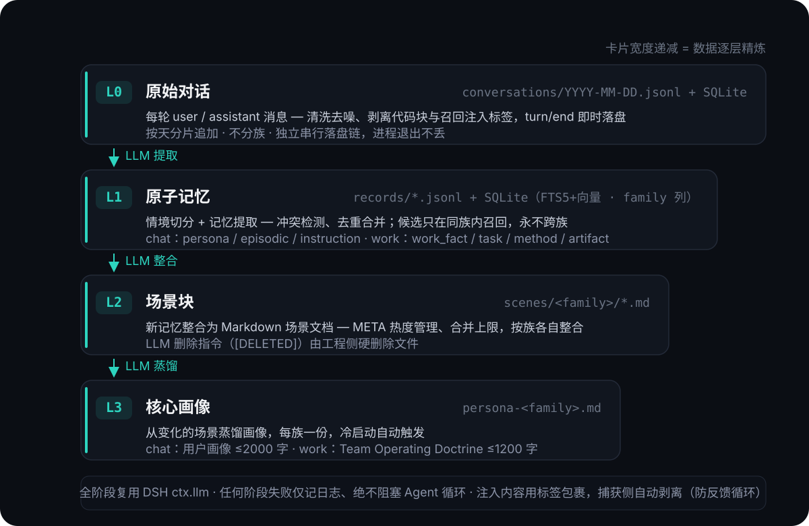
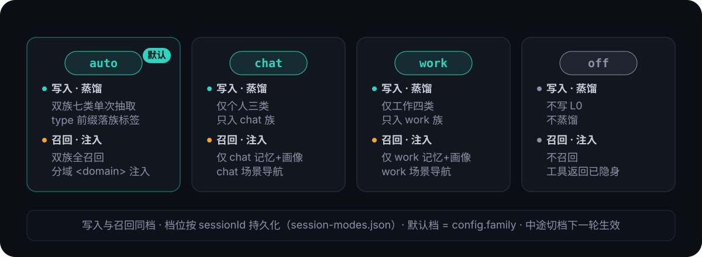

**简体中文** | [English](README.en.md)

<p align="center">
  
</p>

# dsh-layered-memory

DeepSeek Harness 的**分层蒸馏记忆插件**（持久组合插件）：对话在后台自动完成
L0 捕获 → L1 原子记忆 → L2 场景整合 → L3 画像蒸馏，模型每一步前自动把相关记忆
注入上下文——用户与模型都不需要做任何操作。

> 本插件的记忆核心能力（L0–L3 分层蒸馏管线、Prompt 与双写存储设计）参考自
> [TencentDB-Agent-Memory](https://github.com/TencentCloud/TencentDB-Agent-Memory)
> 中的 **MemoryCore**：Prompt 原样保留，仅把"LLM 操作文件"的 L2/L3 流程适配为
> "LLM 输出、工程侧执行"。

## 运行时数据流

<p align="center">
  
</p>

插件挂在 dsh 原生事件缝上（`session/event` 捕获、`agent/pre-step` 注入），
蒸馏调用复用宿主 `ctx.llm`，全程对用户与模型透明。另注册三个模型可主动调用的
记忆工具：`memory_search` / `conversation_search` / `memory_read_scene`。

## 分层记忆（L0–L3）

<p align="center">
  
</p>

- **未蒸馏缓冲持久化**：抽取失败的待重试消息与攒触发阈值中途的消息都暂存在按档
  分桶的缓冲里（`pending.json`，每次蒸馏尝试后原子落盘）——重启不丢，启动 20 秒后
  自动补跑一次，失败则维持"等下一轮同档对话"的语义；
- **重建**（设置页 → 记忆 → 概览 → 重建记忆）：以 L0 原始对话为事实源重新推导全部
  派生层。旧 `records/`、`scenes/`、`persona-*.md` 整体归档（改名 `*.bak.<时间戳>`，
  不删除），检索库清空、checkpoint 重置，随后按会话分块、统一 auto 档重蒸馏
  L1→L2→L3。重建分块走低优先级队列——期间正常对话的蒸馏优先进行；带确认弹窗
  （会话数/消息数/预计调用数）、进度条与取消（已重建部分保留）。

## 会话级记忆档位

<p align="center">
  
</p>

- **控件**：输入栏内、模式选择器右侧的 pill（`记忆·自动`），点击在上方浮出 macOS
  风格滑动选择器——拖拽松手吸附最近档位；深浅主题自适应；
- 每会话的选择按 sessionId 持久化到 `session-modes.json`，重启/恢复会话不丢；
  与全局开关叠加（全局是总闸）；L2/L3 完全分族，间族内容不渗透。

## 快速开始

需要 Node ≥ 22.16。两种调用方式任选（`npx` 前缀可替换下面任何 `dsh` 命令）：

```bash
# 方式一：npx 直接跑官方 CLI（无需预装 dsh；可 pin 版本，如 dsh-layered-memory@0.6.1）
npx -y @deepseek-ai/dsh plugin --profile web add dsh-layered-memory

# 方式二：已装 dsh CLI（dsh 是 pnpm 转发器，未装 pnpm 时先 npm i -g pnpm）
dsh plugin --profile web add dsh-layered-memory

# 包源备选：GitHub 仓库 / 本地路径（开发调试，link: 指向仓库，npm run build + 重启 dsh 即生效）
dsh plugin --profile web add https://github.com/JunNanLYS/dsh-layered-memory
dsh plugin --profile web add /path/to/dsh-layered-memory
```

本包声明了 `dsh.bundle` 组合包层（`cordis.patch.yml`），安装后会**自动挂载插件行**——
不需要再手改 `$DSH_HOME/profiles/web/cordis.patch.yml`。然后重启 DeepSeek Harness，
验证：`~/.dsh/memory/` 下出现 `conversations/ records/ scenes/` 目录和 `memory.db`
即插件 apply 成功；设置页出现"记忆"页面、输入栏出现档位 pill 即 client 半边就绪。

> ⚠️ **安全提示**：安装插件 = 以你的权限运行第三方代码。本插件会读取会话内容、
> 在数据目录写文件、调用你配置的 LLM/embedding 服务；介意请先审查源码（`src/`）。

**卸载**：`dsh plugin --profile web remove dsh-layered-memory` + 重启。数据保留在
`~/.dsh/memory/`，不需要时手动删除整个目录即可。

### 从源码开发

```bash
git clone https://github.com/JunNanLYS/dsh-layered-memory
cd dsh-layered-memory
npm install && npm run build
dsh plugin --profile web add .        # link: 安装，改代码后 npm run build + 重启 dsh 即生效
npm run smoke                         # 冒烟测试（先重编：见下方命令）
npx tsc src/smoke.ts --outDir dist-smoke --module nodenext --moduleResolution nodenext --target es2022 --strict --skipLibCheck --esModuleInterop
```

## 配置

覆盖配置写在 profile 自己的 `cordis.patch.yml`，用**顶层裸 patch 条目**（直接 `id:`，
不要包在 `insert:` 里——insert 与 bundle 层同 id 追加会导致 `duplicate loader entry id`
启动失败）：

```yaml
- id: dsh-memory
  name: dsh-layered-memory
  config:                    # 键按行整体替换（不深合并），按需写全要保留的键
    family: auto             # 新会话默认档：auto | chat | work
    llm:                     # 蒸馏模型路由（不写则跟随当前默认模型）
      provider: ''
      model: ''
```

| 字段 | 默认 | 说明 |
| --- | --- | --- |
| `family` | `auto` | 新会话默认记忆档位：`auto`（双族自动）\| `chat`（个人）\| `work`（工作）；会话内可用输入栏控件临时切换 |
| `dataDir` | `$DSH_HOME/memory` | 数据目录 |
| `capture.enabled` | `true` | L0 捕获 |
| `capture.stripCodeBlocks` | `true` | 助手消息剥离代码块 |
| `capture.maxMessageChars` | `4000` | 单条消息最大字符数 |
| `extract.enabled` | `true` | L1 抽取 |
| `extract.minMessages` | `1` | 攒够 N 条新消息跑一次 L1 抽取 |
| `extract.backgroundMessages` | `10` | 抽取时附带的背景消息条数 |
| `extract.candidatePool` | `5` | 去重候选池大小 |
| `l2.enabled` | `true` | L2 场景整合 |
| `l2.minNewMemories` | `5` | 距上次 L2 整合的新记忆阈值 |
| `l2.maxScenes` | `12` | 场景块数量上限 |
| `l2.sceneContextLimit` | `3` | L2 prompt 附带的相似场景全文上限 |
| `l3.enabled` | `true` | L3 画像蒸馏 |
| `l3.interval` | `20` | L3 蒸馏间隔（新记忆条数） |
| `recall.enabled` | `true` | 自动召回 |
| `recall.maxResults` | `5` | 每步召回注入的 L1 条数 |
| `recall.strategy` | `hybrid` | 检索策略：`keyword` / `embedding` / `hybrid` |
| `recall.scoreThreshold` | `0.3` | 召回分数阈值（低于不注入；仅 keyword/embedding 策略生效，hybrid 融合前不过滤；工具路径不过滤） |
| `embedding.enabled` | `false` | 向量检索开关；关闭即纯 FTS 运行 |
| `embedding.baseUrl` | 空 | OpenAI 兼容 /embeddings 地址（如 `https://api.siliconflow.cn/v1`） |
| `embedding.apiKey` | 空 | API Key |
| `embedding.model` | 空 | embedding 模型名 |
| `embedding.dimensions` | `0` | 向量维度（启用时必填，须与模型输出一致） |
| `embedding.allowLocalModels` | `true` | 允许本地嵌入档（部署上限：关闭后设置页不能下载模型、不能切本地档） |
| `embedding.mirror` | `https://hf-mirror.com` | 本地模型下载镜像根地址（可改回官方 `https://huggingface.co`） |
| `llm.provider/model` | 空 | 蒸馏模型覆盖（默认用当前默认选择） |
| `llm.maxTokens` | `256000` | 单次蒸馏输出 token 上限（全阶段统一；推理模型的 reasoning 与正文共享该预算，过低会被思考吃光导致正文 0 字符） |
| `llm.reasoningEffort` | `off` | 蒸馏思考档位（部署默认）：`off` / `high` / `max`，空串不传（跟随模型默认）。蒸馏是结构化抽取任务，默认关思考——推理模型（如 v4-flash）默认 high 档的思考可把任意输出预算全部吃光导致正文 0 字符；非推理模型不认识 effort 时需设为空串。运行时可在设置页 → 记忆 → 概览临时切换（选"跟随配置"即回退本值） |
| `llm.temperature` | `0.3` | 蒸馏温度 |
| `llm.maxInputChars` | `700000` | 单次蒸馏输入字符预算（超限的 L1 输入自动分块抽取） |
| `tools` | `true` | 是否注册模型可调用的记忆工具 |

## 存储布局

<p align="center">
  
</p>

向量能力默认关闭（纯 FTS）。DSH 的 `ctx.llm` 无 embeddings 端点，语义检索由
**三态嵌入源**提供（关闭 / 远程 / 本地），设置页可运行时切换——见下节。

## 语义检索（嵌入源）

设置页（记忆 → 概览 → 语义检索）选择嵌入源，即时生效、无需改配置重启：

| 嵌入源 | 说明 |
| --- | --- |
| **关闭**（默认） | 不做任何向量嵌入，纯 BM25 关键词检索 |
| **远程** | 自备任意 OpenAI 兼容 `/embeddings` 服务（`embedding.*` 四件套配齐才可选） |
| **本地** | 内置模型目录选一款，ONNX 量化 **CPU 推理**——无需 API Key，数据不出本机 |

本地模型目录是插件内置白名单（每款锁定 revision + 每文件 sha256，不可下载任意仓库）：

| 模型 | 维度 | 上下文 | 体积 | 特点 |
| --- | --- | --- | --- | --- |
| BGE small 中文 | 512 | 512 | ~25MB | CPU 嵌入最快，适合先体验语义检索 |
| EmbeddingGemma 300M | 768 | 2048 | ~330MB | 100+ 语言含中文，质量与开销均衡（上游 MemoryCore 同款） |
| BGE-M3 | 1024 | 8192 | ~590MB | 中文质量最强，单条嵌入可达秒级 |

- **下载**：模型卡一键下载（默认镜像 `hf-mirror.com`，断点续传 + sha256 完整性
  校验），落盘数据目录 `models/<id>/`，不用了随时在设置页删除；
- **按需运行时**：首次切换本地档才安装推理运行时（transformers.js，约 100~200MB，
  装进数据目录 `runtime/`——不进插件依赖树，不碰插件安装目录）；
- **活切换**：一键换源——自动后台全量重嵌（进度可见、可取消，期间检索自动降级
  关键词，不影响对话；维度变化时向量表按新维度重建）；切换失败保持旧源，重启仍
  按原源运行；
- **生效规则 = 部署上限 AND 运行时选择**：`embedding.allowLocalModels=false` 可整体
  禁用本地档、未配 `embedding.*` 四件套则远程档不可选（企业部署可收口），状态持久
  化在 `embedding-source.json`。

## 日志与排查

dsh 宿主把插件日志打到控制台，插件将 info 及以上镜像到数据目录 `memory.log`。一轮
对话的典型日志路径：`L0 捕获` → `L0 落盘` → `蒸馏管线开始` → `LLM 调用（输入/输出
字符数、耗时）` → `L1 抽取完成` → `蒸馏管线结束`；下一轮有 `召回命中 N 条 L1`。
LLM 空输出带完整诊断（finish 原因 / token 计数 / reasoning 摘录），JSON 解析失败
附模型原始输出前 400 字符，失败 warn 均带堆栈首帧。

## 与 MemoryCore 的差异

- 内嵌完整管线（不依赖外部 Gateway），蒸馏复用 DSH 自己的 LLM；
- L2/L3 由"LLM 操作文件工具"改为"LLM 输出操作 JSON / 完整文档，工程侧执行"；
- 召回注入点在 `agent/pre-step` + agent 作用域 `systemPrompt.context`（DSH 原生事件/服务）；
- 存储/检索即官方 sqlite 后端的单机裁剪版（裁掉多租户隔离列、TCVDB 云后端、审计表；
  分词用自带 CJK 二元组替代 jieba，保持零原生依赖——仅 sqlite-vec 一个原生扩展，
  加载失败自动降级）。

## 致谢

记忆核心能力（分层蒸馏管线、Prompt 设计、双写存储架构）参考自
[TencentCloud/TencentDB-Agent-Memory](https://github.com/TencentCloud/TencentDB-Agent-Memory)
项目中的 **MemoryCore**，感谢原项目开放的设计与实现。

## License

[MIT](LICENSE)
